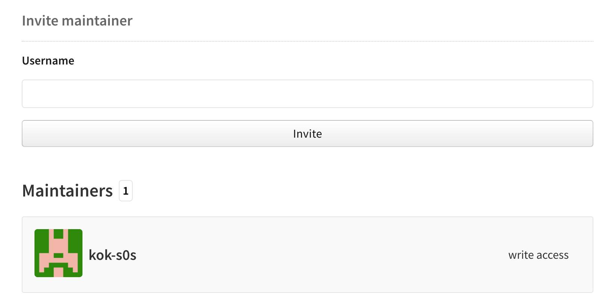

# ESlint

目前适用于 React + TypeScript 的项目

## 如何安转？

```bash
npm i eslint-config-scnu -D
```

## 如何使用？

在 package.json 文件中加入以下内容即可

```json
{
  ...
  "eslintConfig": {
    "extends": ["scnu"]
  },
  ...
}
```

加入指令

```json
{
  ...
  "scripts": {
    ...
    "lint": "eslint .",
    "lint:fix": "eslint --fix ."
    ...
  },
  ...
}
```

创建 `.eslintignore` 文件，其作用和 `.gitignore` 作用差不多，ESlint 会根据 `.eslintignore` 来检查要忽略的文件。

编辑 `.vscode/settings.json` 文件，加入以下内容，在 VSCode 编辑器就可以保存时自动修复。

```json
{
  ...
  "prettier.enable": false,
  "editor.codeActionsOnSave": {
    "source.fixAll.eslint": true
  }
  ...
}
```

## 如何参与维护？

需要有一个 npm 官网账号，联系作者，作者在项目中邀请即可。

[npm Docs](https://docs.npmjs.com/) --> Documentation for the npm registry, website, and command-line interface



项目目前根据 ESLint 官网文档学习制作的

学习链接&过程

1. [可共享的配置](https://cn.eslint.org/docs/developer-guide/shareable-configs) --> 大致清楚怎么弄个出这个 npm 包以及如何在项目中引用；

2. [开始](https://cn.eslint.org/docs/user-guide/getting-started) --> 清楚 ESLint 的意义-生态啥的；

3. [配置](https://cn.eslint.org/docs/user-guide/configuring) --> 能清楚 ESLint 配置文件中个属性的存在意义；

4. 运行 `npm install -g eslint` 全局安转 `eslint`，再在项目中执行 `eslint --init` 命令（类似脚手架）能弄个基本的配置文件；

5. 搜索网上其它的 “React + TypeScript” 方案，摸清哪些是需要配置的；

6. [Rules](https://cn.eslint.org/docs/rules/) --> 根据文档选择需要的选项，并做配置；快速了解项目中 Rules 里的配置含义，只需要 cv 一下，在官方文档搜索下能找到具体解释；

---

## 项目现状

根据目前需求和 [ESLint 官方文档](https://eslint.bootcss.com/docs/rules/) 制定的规则。

题外话：目前选用的规则是作者个人选择的，有着一定的主观性，团队使用时，若有其它看法，可以发 issue 一起讨论是否有什么规则无用，或是有什么规则需要添加的。

## 项目展望

该包目前只适用与 React + TypeScript 的绝大数情况。不过搜索探索到一位[老哥-antfu](https://github.com/antfu)的[做法](https://github.com/antfu/eslint-config)，他先创建出一个 basic 包，基于这个包扩展出 ts、react、vue 等等包，再来一个大包全包含，这样他以后不管做什么项目都只用引用那个包即可，方便得很，它的包是一个很大的“树”。

[@antfu/eslint-config](https://www.npmjs.com/package/@antfu/eslint-config)

团队可以学习他的做法，不过先根据实际项目搭建，积累 vue、ts、svelte 等情况下的规则确定，再抽离这些项目相通的地方，弄出 basic 包，再构建出类似的大包。
